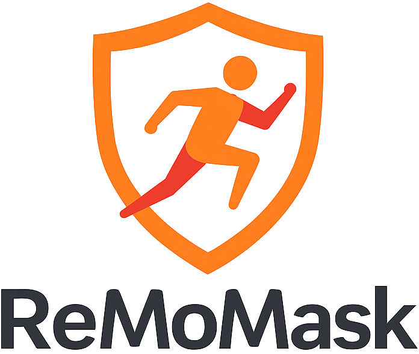

#  ReMoMask-2: Latent Retrieval-Augmented Masked Motion Generation

This repo is the official implementation of:

> **ReMoMask-2: Latent Retrieval-Augmented Masked Motion Generation**
>
>[Yiran Wang](https://scholar.google.com/citations?user=eg_nBF0AAAAJ&hl=en)\*, [Zeyu Zhang](https://steve-zeyu-zhang.github.io/)\*<sup>†</sup>, [Ling Shao](https://ling-shao.github.io/), and [Hao Tang](https://ha0tang.github.io/)<sup>‡</sup>
>
> \*Equal contribution. <sup>†</sup>Project lead. <sup>‡</sup>Corresponding author.
>
> ### [Paper]() | [Website](https://aigeeksgroup.github.io/ReMoMask-2/) | [Model](https://huggingface.co/AIGeeksGroup/ReMoMask-2)

---

## 🤗 Prerequisite

<details>
<summary>Environment, model files, and datasets</summary>

### Environment

Use Python 3.10 and a CUDA GPU.

```bash
conda create -n remomask2 python=3.10 -y
conda activate remomask2
pip install torch==2.1.0 torchvision==0.16.0 --index-url https://download.pytorch.org/whl/cu118
pip install -r requirements.txt
python -c "import clip; clip.load('ViT-B/32', download_root='.')"
```

Install `ffmpeg` for MP4 export. Run the commands below from the repository root.

### Pretrained models and data

Download the [model assets](https://huggingface.co/AIGeeksGroup/ReMoMask-2/tree/main):

```bash
python - <<'PY'
from pathlib import Path
from shutil import copy2
from huggingface_hub import hf_hub_download
files = {
    'net_best_fid_ep0309.tar': 'logs/humanml3d/v2_mtrans_vgate/model/net_best_fid_ep0309.tar',
    'model_opt.txt': 'logs/humanml3d/v2_mtrans_vgate/opt.txt',
    'vq.tar': 'logs/humanml3d/pretrain_vq/model/net_best_fid.tar',
    'vq_opt.txt': 'logs/humanml3d/pretrain_vq/opt.txt',
    'mean.npy': 'logs/humanml3d/pretrain_vq/meta/mean.npy',
    'std.npy': 'logs/humanml3d/pretrain_vq/meta/std.npy',
    'query_projector.pt': 'logs/query_projector_repair_ep/best_projector.pt',
    'encoded_motions.npy': 'database_ze/encoded_motions.npy',
    'encoded_texts_clip.npy': 'database_ze/encoded_texts_clip.npy',
    'motion_ids.npy': 'database_ze/motion_ids.npy',
    'all_captions.npy': 'database_ze/all_captions.npy',
}
for filename, local_path in files.items():
    source = hf_hub_download("AIGeeksGroup/ReMoMask-2", filename, revision="cee377d8361177f0eba1aff57161a20e01ca742e")
    target = Path(local_path)
    target.parent.mkdir(parents=True, exist_ok=True)
    copy2(source, target)
PY
```

Prepare [HumanML3D](https://github.com/EricGuo5513/HumanML3D) in `dataset/HumanML3D/`, including `new_joint_vecs/`, `texts/`, `Mean.npy`, `Std.npy`, `train.txt`, `val.txt`, and `test.txt`. For KIT-ML, use `dataset/KIT-ML/` and dataset-specific model assets.

Follow [MoMask's asset instructions](https://github.com/EricGuo5513/momask-codes#2-models-and-dependencies) to place evaluation models in `checkpoints/` and word embeddings in `checkpoints/glove/`. HumanML3D evaluation requires `checkpoints/humanml3d/Comp_v6_KLD005/opt.txt`, its normalization files, and `checkpoints/humanml3d/text_mot_match/model/finest.tar`.

</details>

## 🚀 Demo

```bash
python demo.py --gpu_id 0 --text_prompt "A person walks in a circle." --motion_length 196 --ext demo --mp4
```

Outputs are saved in `outputs/demo/`: motion features, joint positions, prompt text, and MP4. Use `--text_path prompts.txt` for one prompt per line and `--repeat_times 3` for three samples per prompt.

Generation defaults: `--time_steps 10 --cond_scale 4 --retrieval_topk 1 --retrieval_pool 10 --retr_cfgmix_w 0.75`. Select weights with `--mtrans_name` and the exact filename in `--which_epoch`; select the matching database and projector with `--ze_database_path` and `--projector_path`.

## 🏋️ Training

<details>
<summary>Training commands</summary>

### RVQ

```bash
bash run_rvq.sh pretrain_vq 0 humanml3d --batch_size 256 --num_quantizers 6 --max_epoch 50 --quantize_dropout_prob 0.2 --gamma 0.1 --code_dim2d 1024 --nb_code2d 256
```

### BMM retriever and databases

```bash
python -m Part_TMR.scripts.train device=cuda:0
python build_rag_database.py device=cuda:0
python build_rag_database_ze.py --vq_name pretrain_vq --output_dir database_ze --device cuda:0
python train_query_projector.py --database_ze_path database_ze --database_bmm_path database --output_dir logs/query_projector --device cuda:0
```

### Masked transformer

```bash
bash run_mtrans.sh mtrans 1 0 humanml3d --vq_name pretrain_vq --batch_size 256 --max_epoch 2000 --train_split train.txt --val_split val.txt --attnj --attnt --latent_dim 512 --n_heads 8 --n_layers 8 --ze_database_path database_ze --projector_path logs/query_projector/best_projector.pt --rt_in_value --retr_vgate
```

For multiple GPUs, change `1 0` to the process count and comma-separated GPU IDs, for example `2 0,1`.

Resume masked transformer training with the same model name and `--is_continue`.

</details>

## 📊 Evaluation

```bash
python -m Part_TMR.scripts.test device=cuda:0
python eval_vq.py --gpu_id 0 --name pretrain_vq --dataset_name humanml3d --which_epoch net_best_fid.tar --ext eval
python eval_mask.py --gpu_id 0 --dataset_name humanml3d --mtrans_name v2_mtrans_vgate --which_epoch net_best_fid_ep0309.tar --ze_database_path database_ze --projector_path logs/query_projector_repair_ep/best_projector.pt --rt_in_value --retr_vgate --retr_cfgmix_w 0.75 --retrieval_topk 1 --retrieval_pool 10 --time_steps 10 --cond_scale 4 --repeat_times 20 --ext eval
```

## 🎞️ Visualization

Add `--mp4` to generation for a skeleton video. Add `--bvh` for HumanML3D BVH export:

```bash
python demo.py --text_prompt "A person waves." --motion_length 120 --ext wave --mp4 --bvh
```

## 🙏 Acknowledgements

[ReMoMask](https://github.com/AIGeeksGroup/ReMoMask), [MoMask](https://github.com/EricGuo5513/momask-codes), and [HumanML3D](https://github.com/EricGuo5513/HumanML3D).

## 📄 License

ReMoMask source is distributed under [CC BY-NC-SA 4.0](https://creativecommons.org/licenses/by-nc-sa/4.0/). See [THIRD_PARTY_NOTICES.md](THIRD_PARTY_NOTICES.md) for source attributions and dependency licenses.
